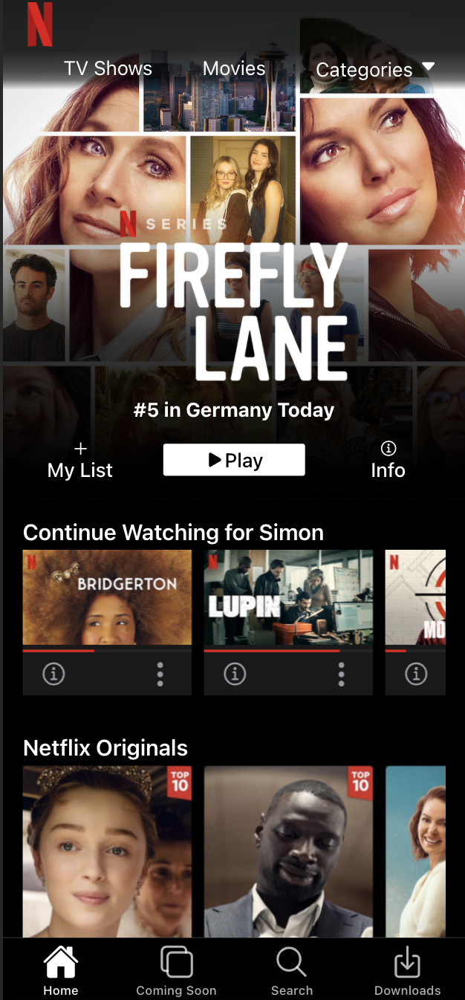

# ionic-template-netflix

Es una plantilla de Ionic con el look and feel de netflix. Basado en el tutorial  [https://devdactic.com/netflix-ui-with-ionic/](https://devdactic.com/netflix-ui-with-ionic/) realizado por [Simon Grimm](https://github.com/saimon24)

